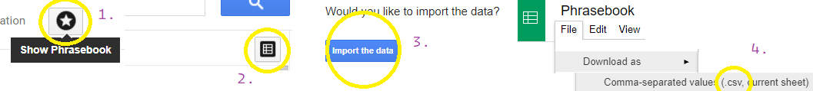

RITMOM - Repetition is the mother of memory.

### What this app does
Learning languages.
Creates audio tracks sourcing a word and phrase pairs from your Google Translate favorites list.

The idea is to use formula
"foreign female slow - native female normal - pause - foreign male slow - native female normal - long pause"
for better memorization.

### What it does not
Text to speech out of a box. It uses 3rd party TTS engines via Windows COM. You have to use
some proprietary TTS engine to generate a good quality narration.

## Usage

1. Install TTS engines
2. You will need *ffmpeg* executable in your PATH to convert your tracks to MP3.
3. Save phrases to `phrases/` dir

4. `pip install -r requirements.txt`
5. `python main.py`

## TODO

- [ ] Tidy up this mess
- [ ] Separate dirs for distinct languages
- [ ] Move translator configuration to the separate file
- [ ] Add audition for separate words from some text corpus (shoot an example with context-bound usage) using NLTK
